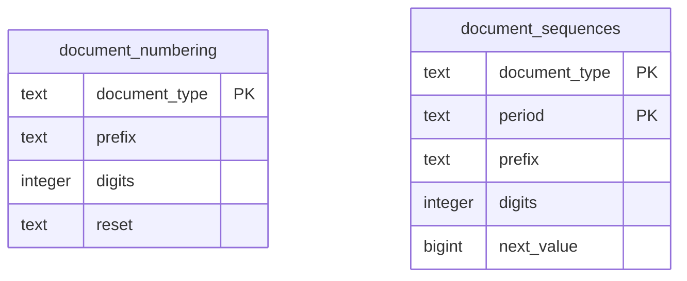

# Tables: numbering

The tables of numbering and their foreign keys, written from the Drizzle
schema by `npm run diagrams` in `server/`. [The index](README.md) says
how to read the diagram.

```mermaid
erDiagram
  document_numbering {
    text document_type PK
    text prefix
    integer digits
    text reset
  }
  document_sequences {
    text document_type PK
    text period PK
    text prefix
    integer digits
    bigint next_value
  }
```
